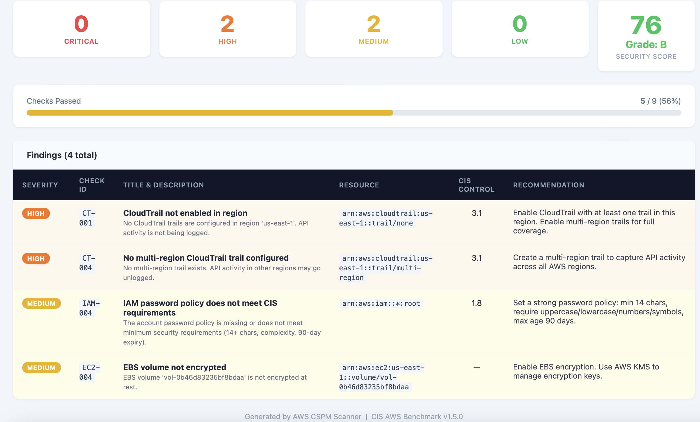

# AWS Cloud Security Posture Management (CSPM) Tool


A Python CLI tool that scans live AWS accounts for misconfigurations across
S3, IAM, EC2, CloudTrail, and RDS, mapping each finding to a
**CIS AWS Benchmark v1.5.0** control and generating a severity-scored
HTML/JSON report.

Designed for security engineers and cloud practitioners who need a lightweight,
extensible alternative to heavyweight CSPM platforms. Built to mirror how
production tools like AWS Security Hub and Wiz approach posture assessment:
modular scanners, standardized finding schemas, and controls mapped to an
industry benchmark. Deployed and tested against a live AWS account running
on EC2.

---

## Sample Report Output



---

## Features

- **5 scanner modules** covering S3, IAM, EC2, CloudTrail, and RDS
- **26 checks** mapped to CIS AWS Benchmark v1.5.0 controls
- **Weighted risk scoring:** 0-100 score with A-F grade based on severity distribution
- **HTML dashboard** with color-coded findings, severity cards, and pass/fail progress bar
- **JSON report** for programmatic consumption or downstream integration
- **Modular architecture:** new scanners added by extending `BaseScanner`, no core changes needed
- **36 moto-mocked unit tests:** full coverage with no real AWS calls required
- **GitHub Actions CI:** pipeline runs on every push and pull request to main

---

## Architecture

```
aws-cspm/
├── main.py                  # CLI entrypoint (Click), scanner orchestration and report generation
├── config.py                # Toggle individual scanners, set target region and output directory
├── scanners/
│   ├── base.py              # Abstract BaseScanner, defines the Finding contract all scanners follow
│   ├── s3.py                # 5 checks: public access, encryption, versioning, logging, ACLs
│   ├── iam.py               # 6 checks: root keys, MFA, password policy, inline policies, key rotation
│   ├── ec2.py               # 5 checks: open SSH/RDP, unrestricted SGs, EBS encryption, IMDSv2
│   ├── cloudtrail.py        # 4 checks: trail enabled, log validation, KMS encryption, multi-region
│   └── rds.py               # 6 checks: encryption, backups, public access, multi-AZ, deletion protection
├── reports/
│   ├── html_report.py       # Self-contained HTML dashboard with severity cards and risk score
│   └── json_report.py       # Structured JSON output with metadata and sorted findings
├── utils/
│   ├── aws_client.py        # Centralized boto3 session factory, all scanners share one session
│   └── severity.py          # Finding dataclass, Severity enum, and weighted risk score calculation
└── tests/                   # 36 moto-mocked unit tests across all 5 scanners
```

Each scanner calls `_add_finding()` with a `Finding` object, a dataclass that enforces a consistent structure (check ID, severity, resource ARN, CIS control, recommendation) across every check in the tool.

---

## Checks Reference

### S3 (5 checks)
| ID | Title | Severity | CIS Control |
|----|-------|----------|-------------|
| S3-001 | Block Public Access not fully enabled | HIGH | 2.1.5 |
| S3-002 | Server-side encryption not enabled | HIGH | 2.1.1 |
| S3-003 | Versioning not enabled | MEDIUM | N/A |
| S3-004 | Access logging not enabled | MEDIUM | 2.1.2 |
| S3-005 | Bucket ACL allows public access | CRITICAL | N/A |

### IAM (6 checks)
| ID | Title | Severity | CIS Control |
|----|-------|----------|-------------|
| IAM-001 | Root account has active access keys | CRITICAL | 1.4 |
| IAM-002 | Root account MFA not enabled | HIGH | 1.5 |
| IAM-003 | Console user MFA not enabled | HIGH | 1.10 |
| IAM-004 | Password policy does not meet CIS requirements | MEDIUM | 1.8 |
| IAM-005 | Inline policies attached to users | HIGH | 1.15 |
| IAM-006 | Access keys not rotated in 90 days | MEDIUM | 1.14 |

### EC2 (5 checks)
| ID | Title | Severity | CIS Control |
|----|-------|----------|-------------|
| EC2-001 | Security group allows unrestricted SSH (0.0.0.0/0) | CRITICAL | 5.2 |
| EC2-002 | Security group allows unrestricted RDP (0.0.0.0/0) | CRITICAL | 5.3 |
| EC2-003 | Security group allows all inbound traffic | HIGH | N/A |
| EC2-004 | EBS volume not encrypted at rest | MEDIUM | N/A |
| EC2-005 | IMDSv2 not enforced, vulnerable to SSRF metadata attacks | MEDIUM | N/A |

### CloudTrail (4 checks)
| ID | Title | Severity | CIS Control |
|----|-------|----------|-------------|
| CT-001 | CloudTrail not enabled, API activity unlogged | HIGH | 3.1 |
| CT-002 | Log file validation disabled, logs could be tampered | HIGH | 3.2 |
| CT-003 | Logs not encrypted with KMS CMK | MEDIUM | 3.7 |
| CT-004 | No multi-region trail, activity in other regions unlogged | HIGH | 3.1 |

### RDS (6 checks)
| ID | Title | Severity | CIS Control |
|----|-------|----------|-------------|
| RDS-001 | Instance not encrypted at rest | HIGH | N/A |
| RDS-002 | Automated backups disabled, no point-in-time recovery | MEDIUM | N/A |
| RDS-003 | Instance publicly accessible from the internet | CRITICAL | N/A |
| RDS-004 | Minor version auto-upgrade disabled, unpatched engine | LOW | N/A |
| RDS-005 | Multi-AZ not enabled, single point of failure | MEDIUM | N/A |
| RDS-006 | Deletion protection disabled, vulnerable to accidental deletion | HIGH | N/A |

---

## Installation

**Requirements:** Python 3.11+, an AWS account with credentials

**Step 1: Clone the repository**
```bash
git clone https://github.com/ChrisCortesSanchez/AWS-CSPM.git
cd AWS-CSPM
```

**Step 2: Create and activate a virtual environment**

A virtual environment keeps the project's dependencies isolated from the rest of your system.
```bash
python3 -m venv venv
source venv/bin/activate
```
You should see `(venv)` appear at the start of your terminal prompt, confirming the environment is active.

**Step 3: Install dependencies**
```bash
pip install -r requirements.txt
```

**Step 4: Configure your AWS credentials**

The tool needs read-only access to your AWS account. Run the following and enter your IAM access key, secret, default region (e.g. `us-east-1`), and output format (`json`):
```bash
aws configure
```
The IAM user only needs `ReadOnlyAccess` attached. The scanner never writes to or modifies your account.

---

## Usage

```bash
# Scan all services, output HTML report (default)
PYTHONPATH=. python3 main.py

# Scan a specific region
PYTHONPATH=. python3 main.py --region us-west-2

# Output both HTML and JSON
PYTHONPATH=. python3 main.py --output both

# Run specific scanners only
PYTHONPATH=. python3 main.py --scanners s3,iam

# Use a named AWS CLI profile
PYTHONPATH=. python3 main.py --profile my-profile
```

**Sample terminal output:**
```
==============================================================
  AWS Cloud Security Posture Management (CSPM) Scanner
==============================================================
  Account : 288548446336
  Region  : us-east-1
  Time    : 2026-03-19 16:20 UTC
==============================================================

Running scanners...

  Scanning S3...
  [S3]  CRITICAL: 0 | HIGH: 0 | MEDIUM: 0 | LOW: 0
  Scanning IAM...
  [IAM]  CRITICAL: 0 | HIGH: 0 | MEDIUM: 1 | LOW: 0
  Scanning EC2...
  [EC2]  CRITICAL: 0 | HIGH: 0 | MEDIUM: 1 | LOW: 0
  Scanning CLOUDTRAIL...
  [CLOUDTRAIL]  CRITICAL: 0 | HIGH: 2 | MEDIUM: 0 | LOW: 0
  Scanning RDS...
  [RDS]  CRITICAL: 0 | HIGH: 0 | MEDIUM: 0 | LOW: 0

==============================================================
  Scan Complete: 4 findings across 5 scanner(s)
==============================================================
  CRITICAL : 0
  HIGH     : 2
  MEDIUM   : 2
  LOW      : 0
--------------------------------------------------------------
  Security Score : 76/100 (Grade: B)
--------------------------------------------------------------
  Report   : ./output/cspm_report_20260319_162028.html
==============================================================
```

Reports are saved to `./output/` with a UTC timestamp. Open the HTML file in any browser.

---

## Running Tests

Uses [moto](https://github.com/getmoto/moto) to mock all AWS API calls, no real AWS account or credentials needed.

```bash
PYTHONPATH=. pytest tests/ -v
```

36 tests across 5 scanners, covering both passing and failing conditions for every check.

---

## Risk Scoring

The security score is calculated by weighting each failing finding against a worst-case baseline where every check fails at CRITICAL severity:

| Severity | Weight |
|----------|--------|
| CRITICAL | 10 |
| HIGH | 7 |
| MEDIUM | 4 |
| LOW | 2 |

Score maps to a letter grade: A (90-100), B (75-89), C (60-74), D (40-59), F (0-39).

---

## Adding a New Scanner

1. Create `scanners/your_service.py` extending `BaseScanner`
2. Implement `run()` returning a list of `Finding` objects
3. Add to `ENABLED_SCANNERS` in `config.py`
4. Register in the `SCANNERS` dict in `main.py`
5. Write tests in `tests/test_your_service.py` using `@mock_aws`

```python
from scanners.base import BaseScanner
from utils.severity import Finding, Severity

class YourScanner(BaseScanner):
    def run(self):
        self._add_finding(Finding(
            scanner="your_service",
            check_id="SVC-001",
            title="Example misconfiguration",
            description="What is misconfigured and why it matters",
            recommendation="Concrete remediation step",
            severity=Severity.HIGH,
            resource="arn:aws:...",
            region=self.region,
            passed=False,
        ))
        return self.findings
```

---

## Tech Stack

| Tool | Purpose |
|------|---------|
| Python 3.11 | Core language |
| boto3 | AWS SDK, all API calls to S3, IAM, EC2, CloudTrail, RDS |
| Click | CLI argument parsing and help text |
| moto | AWS service mocking for unit tests |
| pytest | Test framework |
| GitHub Actions | CI pipeline, runs on every push and PR |

---

## Roadmap

- [ ] VPC scanner: flow logs enabled, default VPC in use, open NACLs
- [ ] Lambda scanner: overly permissive execution roles, secrets in environment variables
- [ ] Multi-region scanning in a single run
- [ ] Slack/email alerting on CRITICAL findings
- [ ] Risk score trend tracking across scans

---

## Author

**Christopher Cortes-Sanchez** — NYU Tandon School of Engineering, B.S. Computer Science (May 2026)  
Cybersecurity + Mathematics minor | SHPE NYU Tandon  
[GitHub](https://github.com/ChrisCortesSanchez) | cc7825@nyu.edu
